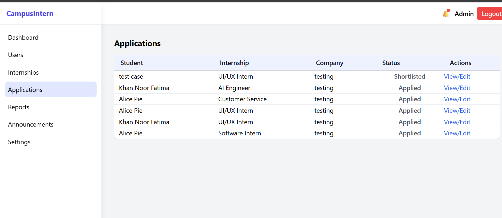
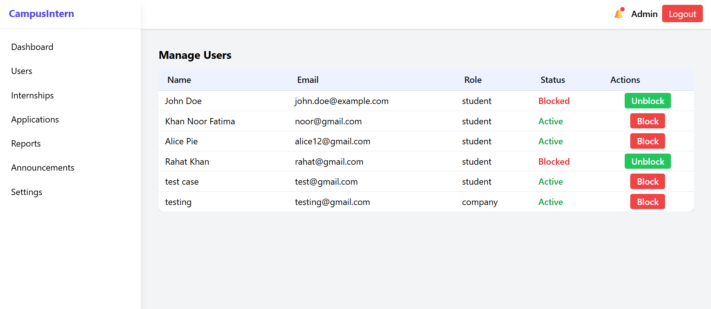

# CampusIntern

**CampusIntern** is a smart internship allotment platform designed for colleges. It helps students discover and apply for internships, allows companies to manage applications, and provides administrators with analytics and control — all in one full-stack web application.

---

## **Features**

### Student
- Create and manage profile.
- Browse internship listings from multiple companies.
- Apply for internships and track application status.
- Upload resume (PDF) for applications.

### Company
- Post internship openings.
- Review and manage student applications.
- Accept or reject applications.
- Download applicant resumes.

### Admin
- Manage students, companies, and internships.
- View analytics for applications and trends.
- Ensure data integrity and security.
- Can also block companies or students.
- Can post announcements and students will be able to see them in their respective dashboard.

---

## **Technologies Used**
- **Frontend:** HTML, CSS, Tailwind CSS, JavaScript
- **Backend:** Node.js, Express.js
- **Database:** MongoDB
- **Authentication:** JWT (JSON Web Tokens)
- **Version Control:** Git & GitHub

---

## **Screenshots** 

### Student Dashboard – Applied Internships
.png)  

### Student Dashboard – Internship Listings
.png)

### Admin Dashboard – Analytics
  

### Admin Dashboard – Student Management


---

## **Getting Started**

### **Prerequisites**
- Node.js and npm installed
- MongoDB installed or use a cloud database
- Git installed

### **Installation**
1. Clone the repository:
```bash
git clone https://github.com/RahatKhan1311/CampusIntern.git
